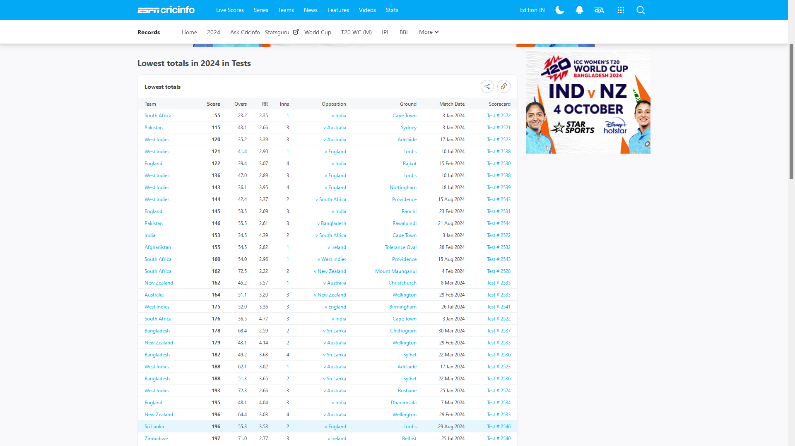
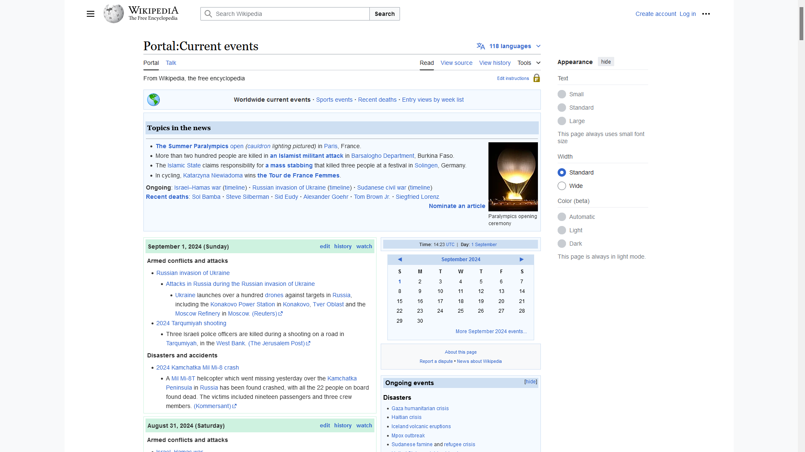

# Web Scraping Project: ESPN Cricinfo and Wikipedia

## Project Overview

This project demonstrates how to use Python for web scraping to extract data from the ESPN Cricinfo and Wikipedia websites. The project uses two main libraries:

- **Pandas**: For extracting tables from the ESPN Cricinfo webpage.

- **BeautifulSoup**: For parsing and extracting specific information from a Wikipedia page.


## Tools and Libraries

- **Python 3.x**
- **Pandas**
- **BeautifulSoup**
- **Requests**

## Installation

To run this project, you need to have Python installed along with the required libraries. You can install the libraries using `pip`.

```bash
pip install pandas
pip install beautifulsoup4
pip install requests
```
Usage
##1. Extracting Tables from ESPN Cricinfo




The script uses Pandas' read_html() function to extract tables from a specific ESPN Cricinfo webpage.

```bash
import pandas as pd

# URL of the webpage
url = "https://www.espncricinfo.com/series/ipl-2024"

# Extracting tables from the webpage
tables = pd.read_html(url)

# Display the first table
print(tables[0])
```
2. Extracting Information from Wikipedia
3. 


The script uses BeautifulSoup to parse and extract specific information from a Wikipedia page.
bash
```
from bs4 import BeautifulSoup
import requests

# URL of the Wikipedia page
url = "https://en.wikipedia.org/wiki/Indian_Premier_League"

# Sending a request to the webpage
response = requests.get(url)

# Parsing the webpage content
soup = BeautifulSoup(response.content, 'lxml')

# Extracte what you want using find and find_all by specifying tags
first_paragraph = soup.find('p').get_text()


print(first_paragraph)
```
